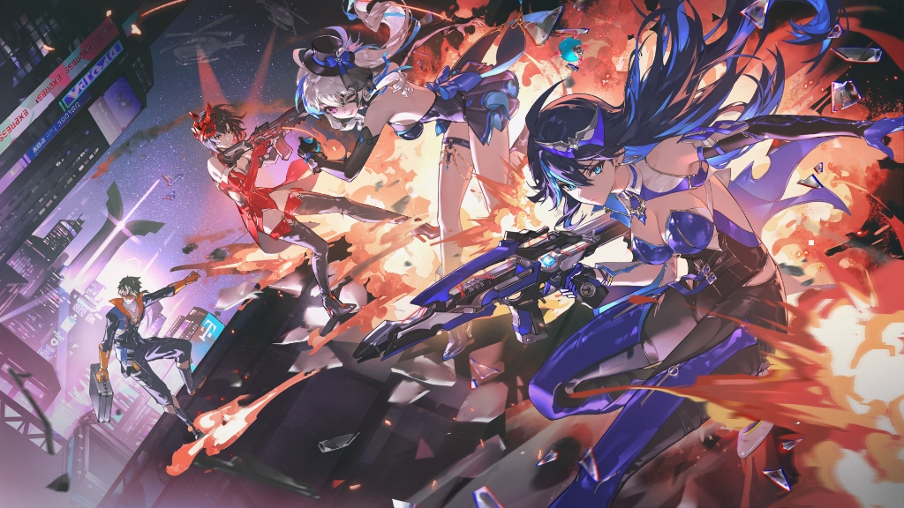
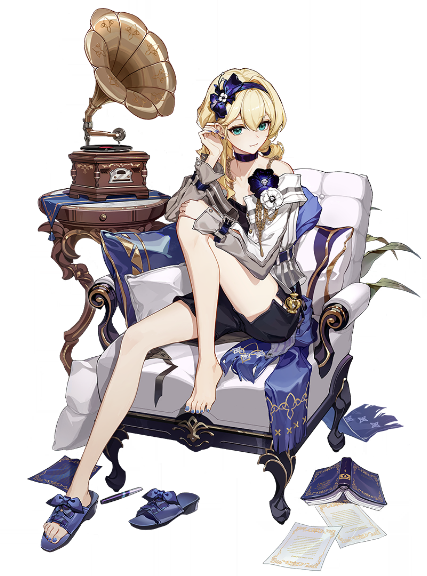
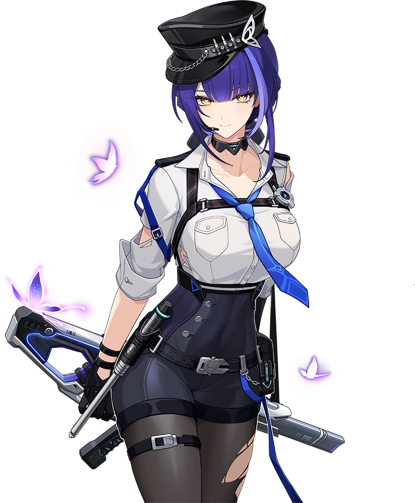
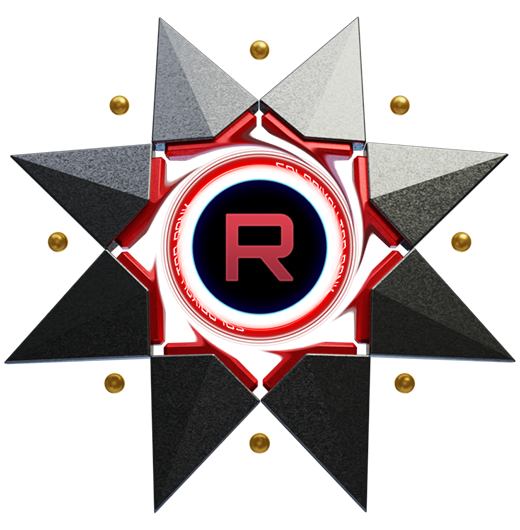
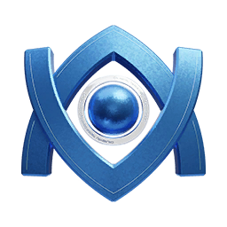
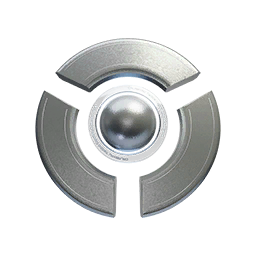

# NekoBoostingService
The ultimate (satirical) elite boosting platform for Strinova. Featuring high-velocity rank climbs, professional throwing services, and the most sophisticated 'Bablo' economy on the web, offered by the Azu Corp. 

  
  <h1>🌟 Neko Elite Services | Strinova Boosting 🌟</h1>
  
<strong>The #1 (and most troll) boosting service for Strinova!</strong>

  
  
  
  

  *THIS IS A JOKE GUYS DONT TAKE IT SERIOUSLY... BUT I ACCEPT GENEROUS DONATIONS HIHI - AZUMACHI*

---

## 🚀 About The Project

**Neko Elite Services** is a parody showcase website created to have some fun with the **Strinova** universe. It's a (fake) ultra-premium "boosting" agency where each "booster" has their own unique and hilarious personality.

Whether you want to tryhard and reach the Singularity rank with *Neko* or comfortably "Reverse Boost" all the way down to the abyss with *Azumachi*, this platform has everything you need!

> *Note: This website is a purely humorous creation made for the community 🎮. No actual boosting services are sold here.*

---

## ✨ Features & Design

- 🎨 **Cyberpunk / Gamer Aesthetics**: Dark Mode theme, high-contrast cyan (`#00F0FF`) and orange (`#FF6B00`) tones, glassmorphism, and glowing hover effects.
- 🧑‍🚀 **Detailed Booster Profiles**: An immersive tab system presenting the elite team: Neko, Azumachi, Elabearie, Emiko, Keroppi, Lifhee, Glacyon, and Junlean.
- ⭐ **Fake "Trustpilot" Review System**: Hilarious and quirky testimonials from clients who are thrilled to have been scammed or successfully dropped to lower ranks.
- 📈 **Responsive Design**: Fully adaptable, from your large desktop monitor to your smartphone.

---

## 📸 Meet Our "Talents"

Here is a sneak peek at our top-tier boosters:

  <table>
    <tr>
      <td align="center">
         
        <b>🔹 NEKO</b> 
        <i>The Singularity Player</i> 
        Specialty: Hard Carry
      </td>
      <td align="center">
         
        <b>🔸 AZUMACHI</b> 
        <i>The Troll</i> 
        Specialty: Reverse Boosting
      </td>
    </tr>
  </table>

---

## 🛠️ Tech Stack

This site is built the old-school way to maintain full creative control, with zero bloatware:

*   **HTML5**: Semantic structure.
*   **"Vanilla" CSS3**: Custom animations, Flexbox/Grid, heavy use of clip-paths for that sharp UI aesthetic, and *Frost Glass* effects (`backdrop-filter`).
*   **JavaScript**: Smooth tab switching and interactions.
*   **Google Fonts**: A mix of `Rajdhani` (for the mechanical vibe) and `Inter` (for readability).
*   **FontAwesome**: Web icons.

---

## ⚙️ How to run it locally?

Nothing to install, no compilation needed, just pure web:

1.  **Clone** or download the source code of this repository as a ZIP.
2.  In the extracted folder, simply **double-click** the `index.html` file to open it in your favorite web browser.
3.  *Enjoy the troll!*

> 💡 *VS Code Tip*: Right-click on `index.html` $\rightarrow$ **"Open with Live Server"** for the best experience.

---

## 👑 Goals and Ranks

A glimpse of what the site promises, featuring official community assets:
*    **Singularity Push**
*    **Flawless Placement Matches**
*    **The fall into the abyss...**

---

  
Made with way too much free time by <strong>Azumachi</strong> & The Community. 🐾

